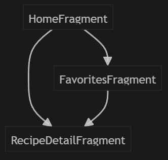
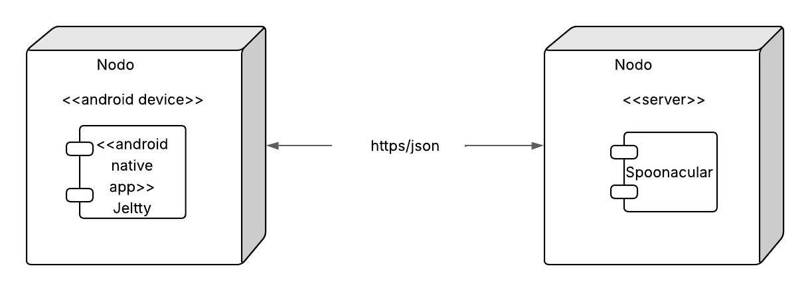

# Documentación Jeltty  

## 1. 📖 Contexto de la aplicación - Análisis  

### Mundo real del problema  
Muchas personas no controlan de manera sencilla y visual sus recetas de comidas favoritas. Las apps ya existentes pueden ser complejas, requerir de conexión o no guardar un recetario personal.  

### ¿Qué apps existen?  
- **MyFitnessPal**: Registra comidas con macros, pero es de suscripción y compleja.  
- **FatSecret**: Registra almientos, pero no recetas favoritas.  
- **Yazio**: Centrada en menús y planes, pero no guarda recetas personales.  

### ¿Por qué Jeltty es mejor?  
- Puede guardaer recetas favoritas de forma local para visualizarlas rápidamente.  
- No necesita conexión constante: las recetas se pueden guardar localmente y se usa la API para obtener nuevas recetas.  
- Interfaz sencilla, intuitiva y centrada en el usuario.  

---  

## 2. 📋 Casos de Uso  

| **Actor**       | **Caso de Uso**            | **Descripción**                                      |  
|----------------|---------------------------|----------------------------------------------------|  
| Usuario        | Consulta recetas         | Visualiza recetas principales y guardadas.          |  
| Usuario        | Añadir a favoritos       | Guarda recetas favoritas.   |  
| Usuario        | Eliminar de favoritos    | Quita recetas de la lista favoritos.             |  
| API Externa    | Obtener recetas  | Descarga recetas desde una API.         |  

---  

## 3. ⚙️ Requisitos  

### Funcionales (F)  
- El usuario puede consultar recetas con sus detalles.  
- El usuario puede añadir/eliminar recetas favoritas.  
- El usuario puede ver la lista de recetas favoritas.  
- El usuario puede consultar recetas nuevas.  

### No Funcionales (NF)  
- Almacenamiento local con Room.  
- Sincronización de API cuando hay conexión.  
- Interfaz intuitiva y rápida.  
- Compatibilidad con Android 7.0 (API 24) y/o superior.  
- Uso adecuado de permisos (INTERNET).  

---  

## 4. 🎨 Diseño  

### GUI (Interfaz Gráfica de Usuario)  
- **Pantalla Home**: Lista de recetas sugeridas, acceso a sus detalles y acceso a lista de favoritos.  
- **Pantalla Detalle**: Información de la receta con opción de añadir a favoritos.  
- **Pantalla Favoritos**: Lista de recetas favoritas con opción de eliminar.  

### UI (Interfaz de Usuario)  
- Diseño limpio, navegación por fragments.  
- Botones claros para gestionar favoritos.  

### Diagrama de Navegación  

---  

## 5. 🔄 Reutilización (fragmentos futuros)  
- Adaptador de recetas en Home y Favoritos.  
- Fragmentos de Home, Detalle y Favoritos.  
- ViewModels reutilizables.  

---  

## 6. 🏗️ Arquitectura  
- **MVVM**: Separación de lógica de presentación y datos.  
- **Clean Architecture**: Paquetes de datos (Room, Retrofit), dominio (modelos, casos de uso), presentación (ViewModels, Fragments).   

### Diagrama de despliegue

---  

## 7. 💾 Base de datos  

### Tablas y relaciones  
**Tabla: recipes**  
- `id` (PK)  
- `title`  
- `ingredients`  
- `description`  
- `imageUrl`  
(Las recetas son independientes, no hay relaciones complejas.)  

---  

## 8. Plan de pruebas  
- Prueba de visualización recycler view.  
- Prueba de añadir/eliminar favoritos.  
- Prueba de navegación.  
- Prueba de obtención de recetas remotas con API.

---  

## 9. ⚡ Implementación de componentes  

### Fragmentos:  
- **HomeFragment**: Muestra las recetas.  
- **RecipeDetailFragment**: Muestra detalles de las recetas y permite añadirlas a favoritos.  
- **FavoritesFragment**: Lista cpn favoritos permite eliminar favoritos.  

### Actividades:  
- **MainActivity**: Contenedor de fragments con la navegación principal.  

### MVVM:  
- **HomeViewModel, FavoritesViewModel**: Gestionan lógica y datos de cada fragmento.  

### Arquitectura CLEAN:  
- "data" (Room, Retrofit)
- "domain" (modelos, repositorios)
- "presentation" (ViewModels, UI)

### RecyclerView:  
- La listas en Home y Favoritos.  

### Navegación:  
- Navigation Component en transiciones entre fragments.  

### BD:  
- Room para persistencia local de las recetas favoritas.  

### REST:  
- Retrofit para obtener recetas de la API.

---  

## 10. Información técnica  
- **Versión mínima de Android**: 7.0 (API 24)  
- **Permisos**: INTERNET  
- **Emulador recomendado**: Android Studio Emulator (Pixel 4, API 30+)  
- **Software necesario**:  
  - Android Studio Koala o superior  
  - JDK 17+  
  - Conexión a internet para recetas remotas  
